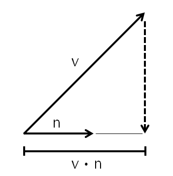
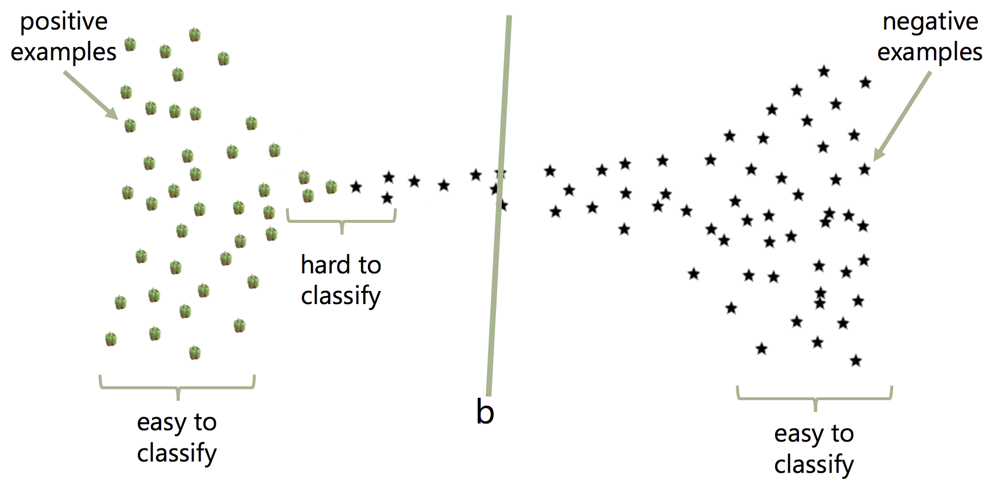
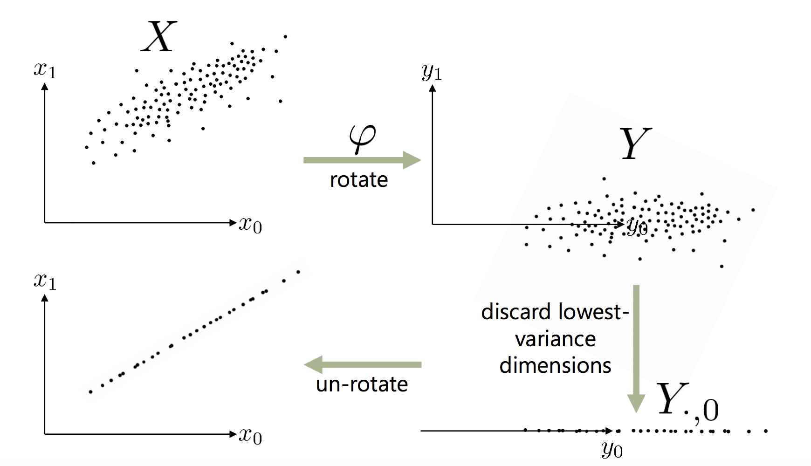

**This cheatsheet is the summary of content taken from UCSD course:**

[CSE 258: Web Mining and Recommender System](http://cseweb.ucsd.edu/classes/fa18/cse258-a/)

---

# General Modeling Knowledge

## Learning Methods

**Supervised Learning** aims to directly model the relationship between input and output variables, so that the output variables can be predicted accurately given the input

**Unsupervised Learning** approaches find patterns, relationships and structure in data, but **are not** optimized to solve a particular predictive task. Most of the Unsupervised Machine Learning Methods are data reconstruction or data encoding algorithms.

## Data Encodings

There are three types of features: **real-value feature**, **categorical feature** and **random feature**

Categorical feature is especially tricky to deal with because its possible values are discrete rather than continuous. We cannot simply fit a line across categorical data, in which case sequence doesn't matter. 

- Ordinal Data (Temporal Data): Encode it as (1, 2, 3, .. n)
- Unordinal Data: Use **One-Hot Encoding** [0, 1, 0, ..., 0]

Mathematic Formula for One-Hot Encoding in Regression
$$c = \theta_0 + \theta_1[\textrm{is male}] + \theta_2[\textrm{is female}]$$

&nbsp;

## Model Selection

**(Train | Validation | Test)** split is important for determining various aspect of a predictive function.

- Training set: used to **optimize the model's parameters** : choose $\theta$
- Test set: used to report how well we expect the model to perform on unseen data: only used **once**
- Validation set: used to **tune** any model parameters that are not directly optimized: choose $\lambda$

### Theorems

- The training error **increases** as $\lambda$ increases
- The validation and test error are at least as large as the training error (assuming infinitely large random partitions)
- The validation/test error will usually have a "sweet" spot between under- and over-fitting

## Imbalanced Dataset

When implimenting classifiers, sometimes there are far **fewer** positive examples than negative examples we may want to assign additional weight to
negative instances. 

Definition:

- True Positive (TP): label is true, prediction is true (correct predictions)
- True Negative (TN): label is false, prediction is false
- False Positive (FP): label is false, prediction is true (incorrect predictions)
- False Negative (FN): label is true, prediction is false

Reference to Binary Classification Performance Cheat Sheet *Figure 1*

---

# Machine Learning Algorithms

## Linear Regression

**Formula**
$$X\theta = y$$

- X is matrix of features (data)
- $\theta$ is unknowns (which features are relevant)
- y is the vector of outputs (labels)

### Movitation

If $X$ is a $m$x$n$ matrix and $m \geq n$ (number of observations $\geq$ number of predictive features), then $X$ is an **inconsistent** matrix. Since $X$ is inconsistent with $y$ not exists in the subspace of $X$, we need to project $y$ onto the span of $\theta$.

{width=30%}

Note in *Figure 2*, $v - (v \cdot n) n$ is the **residual** vector which is **orthogonal** to vector $n$.

### Optimization

Find $\theta$ such that $||X\theta - y||^2_2$ is minimized. The reason we use the residual norm of 2 is for convenient differentiation of the function.

$$
\begin{aligned}
||X\theta - y||^2_2 &= (X\theta - y)^T(X\theta - y) \\
&= \theta^TX^TX\theta - y^TX\theta - \theta^TX^Ty + y^Ty
\end{aligned}
$$

Because $y^TX$ is scalar, which implies $y^TX\theta = (y^TX\theta)^T = \theta^TX^Ty$

$$||X\theta - y||^2_2 = \theta^TX^TX\theta - 2y^TX\theta + y^Ty$$

Differentiate the cost function:
$$ \frac{\partial}{\partial_{\theta}} f = 2X^TX\theta - 2y^TX = 0 $$
$$X^TX\theta = y^TX$$
$$\theta = (X^TX)^{-1}y^TX$$

### MSE Mean-squared error (Numeric Explanation)

$$\frac{1}{N}||y-X\theta||^2_2 = \frac{1}{N}\sum_{i=1}^N(y_i - X_i \cdot \theta)^2$$

Motivation behind MSE is the assumption that $\textrm{label (truth)} = \textrm{prediction} + \textrm{error}$, where error is distributed with a normal distribution of $N(0, \sigma)$. This results in the prediction function as:

$$P_{\theta}(y|X, \theta) = \prod_i \frac{1}{\sqrt{2\pi\sigma}}e ^ {\frac{-(y_i-x_i\cdot\theta)^2}{2\sigma^2}}$$
$$
\begin{aligned}
\textrm{max}_\theta P_{\theta}(y|X, \theta) &= \textrm{max}_\theta \prod_i e ^{-(y_i-x_i\cdot\theta)^2} \\
&= \textrm{min}_\theta \sum_i (y_i - x_i\cdot \theta)^2
\end{aligned}
$$

### Coefficient of determination (R^2 statistic): Regression Diagnostics

**FVU**, fraction of variance unexplained. If $\textrm{FVU}(f) = 1$, $f$ is **trivial** predictor. If $\textrm{FVU}(f) = 0$, $f$ is **perfect** predictor.

$$\textrm{FVU}(f) = \frac{\textrm{MSE}(f)}{\textrm{Var}(y)}$$

If $R^2 = 0$, $f$ is **trivial** predictor. If $R^2 = 1$, $f$ is **perfect** predictor.

$$R^2 = 1 - \textrm{FVU}(f) = 1 - \frac{\textrm{MSE}(f)}{\textrm{Var}(y)}$$

### Regularization

Regularization is the process of penalizing model complexity during training.

---

## Naive Bayes

Naive Bayes is a classification algorithms that assumes that features are **conditionally independent** given the label. 

$$(\textrm{feature}_i, \textrm{feature}_j | \textrm{label}) = (\textrm{feature}_i|\textrm{label})(\textrm{feature}_j|\textrm{label})$$

Using Bayes Theorem:
$$p(\textrm{label}|\textrm{features}) = \frac{p(\textrm{label})\prod_i p(\textrm{feature}_i|\textrm{label})}{p(\textrm{features})}$$
Assume label is binary result, and the probability of **not label** is represented as $p(\textrm{-label}|\textrm{features})$
$$\frac{p(\textrm{label}|\textrm{features})}{p(\textrm{-label}|\textrm{features})} = \frac{p(\textrm{label})\prod_i p(\textrm{features}_i|\textrm{label})}{p(\textrm{-label})\prod_i p(\textrm{features}_i|\textrm{-label})}$$

### Advantages

- Easiest to implement, most efficient to "train"
- If we have a process that generates feature that are independent given the label, it's a very sensible idea

### Disadvantage of Naive Bayes 

Because both features encode essentially the same information when calculating $p(\textrm{label}|\textrm{features})$ and $p(\textrm{-label}|\textrm{features})$, we will end up **double-counting** their effect.

---

## Logistic Regression

Logistic regression is essentially a linear regression being mapped into a [0, 1] dimension space using a **Sigmoid** function. The classifier form is:

$$
 y_i =
  \begin{cases}
   1        & \text{if } X_i \cdot \theta > 0 \\
   0        & \text{otherwise}
  \end{cases}
$$

### Motivation

With $y_i$ is either 0 or 1, we need to have a linear regression that separate the $P(Y=0)$ as far away as possible from $P(Y=1)$, which is to maximize the total probability of $P(Y=0 | X,\theta)$ in addition to the total probability of $P(Y=1|X,\theta)$. Note there is **no double counting** as it occurs in Naive Bayes.

$$
\begin{aligned}
\textrm{argmax}_\theta &= \prod_{y_i=1} P_\theta (y|X) \prod_{y_i=0}(1-P_\theta(y|X))
&= \prod_{y_i=1} \sigma(X_i\theta) \prod_{y_i=0}(1-\sigma(X_i\theta))
\end{aligned}
$$

### Sigmoid Function 
$$\sigma (t) = \frac{1}{1+e^{-t}}$$

### Optimization

- Take logarithm
- Subtract regularizer
- Compute gradient
- Solve using gradient ascent

$$L_\theta(y|X) = \prod_{y_i=1}p_\theta(y_i|X_i)\prod_{y_i=0}(1-p_\theta(y_i|X_i))$$

Take the logarithm of the original Loss function for computational convenience:
$$
\begin{aligned}
l_\theta(y|X) &= \sum_{y_i=1}\log \sigma(X_i\theta) + \sum_{y_i=0}\log (1-\sigma(X_i\theta)) - \lambda||\theta||^2_2 \\
&= \sum_{y_i=1}\log (\frac{1}{1+e^{-X_i\theta}}) + \sum_{y_i=0}\log (\frac{e^{-X_i\theta}}{1+e^{-X_i\theta}})- \lambda||\theta||^2_2 \\
&= \sum_{y_i=1}-\log (1+e^{-X_i\theta}) + \sum_{y_i=0}-\log (1+e^{-X_i\theta}) + \sum_{y_i=0}-X_i\theta- \lambda||\theta||^2_2 \\
&= \sum_{y_i}-\log (1+e^{-X_i\theta}) + \sum_{y_i=0}-X_i\theta- \lambda||\theta||^2_2
\end{aligned}
$$
Taking the Differentiation of the loss function:
$$
\begin{aligned}
\frac{\partial l}{\partial \theta_k} &= \sum_i \frac{x_{ik}e^{-X_i\theta}}{1+e^{-X_i\theta}} + \sum_{y_i=0}-x_{ik} - 2\lambda \theta_k \\
&= \sum_i x_{ik}(1-\sigma(X_i\theta)) - \sum_{y_i=0}x_{ik} - 2\lambda\theta_k
\end{aligned}
$$
Perform Gradient Descent:
$$\theta_k := \theta_k - \alpha \frac{d}{d\theta_k} l(\theta)$$

### Generalization

We can generalize logistic regression for **binary** classification into **multiclass** classification by training a binary predictor for each class. In the event that **multiclass** predictions are inconsistent, choose the one with the highest confidence.

### Advantages
Fixes the "double counting" problem present in naive Bayes

### Disadvantages

- Logistic regressors **don't** optimize the **number of "mistakes"**. It is simply trying to separate the difference between the general label groups $Y=0$ and $Y=1$. 
- No special attention is paid to the "difficult" instances (which can be inconsistent in classifying edge cases laying on top of the boundary) - every instance influence the model
- "easy" instances that has high confidence can affect the model in a bad way
- The model is more expensive to train compared to naive bayes

{width=80%}

---

## Support Vector Machine

### Motivation

The intuition behind Support Vector Machines (SVMs) is to train a classifier that focuses on the **difficult** examples by minimizing the **misclassification error**. Our classifier form is:

$$
 y_i =
  \begin{cases}
   1        & \text{if } X_i \cdot \theta - \alpha > 0 \\
   -1        & \text{otherwise}
  \end{cases}
$$

We want to minimize the number of misclassifications:
$$
\text{argmin}_\theta \sum_i \delta(y_i(X_i\cdot\theta-\alpha)\geq 0)
$$

### Support Vector

Because $\theta x - \alpha = 0$ is a hyperplane and $\theta$ is underdeterminated, there are many solutions to $\theta$. In this case, we need regularization to enforce the best solution of $\theta$. Here we will choose the classifier that maximizes the distance to the nearest point.

{width=80%}

### Distance from Point to Line
Suppose we are trying to calculate the distance between a line to a point.
$$
\begin{aligned}
\text{line} &: ax+by+c=0 \\
\text{point} &: x_0, y_0
\end{aligned}
$$
Then the distance from the line to the point is:
$$d(\text{line}, \text{point}) = \frac{|ax_0 + by_0 + c|}{\sqrt{a^2+b^2}}$$
Apply the same principle to the classifier, for all $x_i$, the distance between $x_i$ to $\theta X - \alpha = 0$ should be greater or equal to the distance from support vector $\theta X - \alpha = 1$ or $\theta X - \alpha = -1$ to $\theta X - \alpha = 0$

$$\frac{(\theta X_i - \alpha)y_i}{||\theta||_2} \geq \frac{1}{||\theta||_2}$$

### Optimization

Because the distance between the center regression line and the two support vectors is $\frac{1}{||\theta||}$ and we want to maximize the distance $\frac{2}{||\theta||}$, for mathematic convenience, we can solve the same problem by minimize $\frac{1}{2}||\theta||^2_2$.

$$\text{argmin}_{(\theta, \alpha)} \frac{1}{2}||\theta||^2_2 \text{\ \ \ \  s.t.}\forall_iy_i (\theta \cdot X_i - \alpha) \geq 1$$

This is known as a **quadratic program** (QP) and can be solved using **standard** techniques.

### Soft Margin

If the data is not completely separable or there is a better classification by sacrificing several misclassifications, we can use **soft margin SVM** to treat this issue. By introducing $\xi$, we are able to penalize points that end up on the wrong side of the support vectors.

$$\text{argmin}_{\theta, \alpha, \xi_i > 0} \frac{1}{2}||\theta||^2_2 + \sum_i \xi_i \text{ \ \ \ \   s.t.}\forall_iy_i(\theta \cdot X_i - \alpha) \geq 1 - \xi_i$$

### Advantages
Non-probabilistic: optimizes the classification error rather than the likelihood

### Disadvantages

More expensive to train compared to logistic regression and naive bayes

---

## Principle Component Analysis

### Motivation

- Denoise the data that is dense in certine dimensions and sparse in other dimension. (Dimensionality Reduction)

Assume $X \in R^{M \times N}$, $\varphi \in R^{M \times M}$, and $\varphi$ is basis function such that when $X$ is rotated ($Y=\varphi X$)

- $\varphi_i \cdot \varphi_i = 1$, $\varphi_i^{-1} = \varphi_i^T$
- $\varphi_i \cdot \varphi_j = 0 \text{  if  } i \neq j$
- Dimension with highest variance is $y_0$
- Dimension with $2^{nd}$ highest variance is $y_1$, etc.

{width=90%}

For a single data point: $y = \varphi x$ $x = \varphi^{-1}y=\varphi^Ty$

$$
\begin{aligned}
x &= \varphi_1y_1 + \varphi_2y_2 + \cdots + \varphi_My_M \\
&= \sum_{j=1}^{M} \varphi_jy_j
\end{aligned}
$$

Discarding the additional dimension (K+1 to N) by setting $y_j$ where $K+1 \leq j < N$ to a constant $b_j$ (**Data Reconstruction**)
$$x \simeq \sum_{j=1}^{K}\varphi_j y_j + \sum_{j=K+1}^M \varphi_jb_j$$

### Optimization

minimize **MSE** to get the "best" overall reconstruction.

$$
\begin{aligned}
\text{min}_{\varphi, b} \frac{1}{N} \sum_y ||\sum_{j=1}^K\varphi_jy_j + \sum_{j=K+1}^M\varphi_jb_j - \varphi^Ty||^2_2 
&= \frac{1}{N}\sum_y||\sum_{j=K+1}^M\varphi_j(b_j-y_j)||^2_2 \\
&= \frac{1}{N}\sum_y\sum_{i=K+1}^M\sum_{j=K+1}^M(y_i-b_i)^T\varphi_i^T\varphi_j(y_j-b_j) \\
&= \frac{1}{N}\sum_y^M\sum_{j=K+1}^M(y_j-b_j)^2
\end{aligned}
$$

Set $b_j = \bar{y}_j$ as the average of $j^{th}$ dimension:

$$\text{min}_\varphi \frac{1}{N}\sum_y\sum_{j=K+1}^M(y_j-\bar{y}_j)^2$$

(subject to $\varphi$ **orthonormal**)

Expand in terms of $X$

$$\text{min}\frac{1}{N} \sum_{j=K+1}^M \varphi_j(X-\bar{X})(X-\bar{X})^T\varphi_j^T$$

### Regularization

We want to minimize **MSE** with subject to the constrain ($\varphi_i \cdot \varphi_i = 1$ $\forall i, i \geq N$)

**Apply Lagrange Multipliers**

$$\text{min}\frac{1}{N} \sum_{j=K+1}^M \varphi_jCov(X)\varphi_j^T - \lambda(\varphi_j\cdot\varphi_j - 1)$$

**Solve**

$$\frac{\partial}{\partial \varphi_j}\sum_{j=K+1}^M \varphi_jCov(X)\varphi_j^T - \lambda(\varphi_j\cdot\varphi_j - 1) = 0$$

$$Cov(X)\varphi_j^T = \lambda_j\varphi_j^T$$

$$A\varphi^T = \lambda\varphi^T$$

- This expression can only be satistifed if $\varphi_j$ and $\lambda_j$ are an **eigenvectors/eigenvalues** of the covariance matrix
- So to minimize the original expression we'd discard $\varphi_j$'s corresponding to the smallest eigenvalues

---

