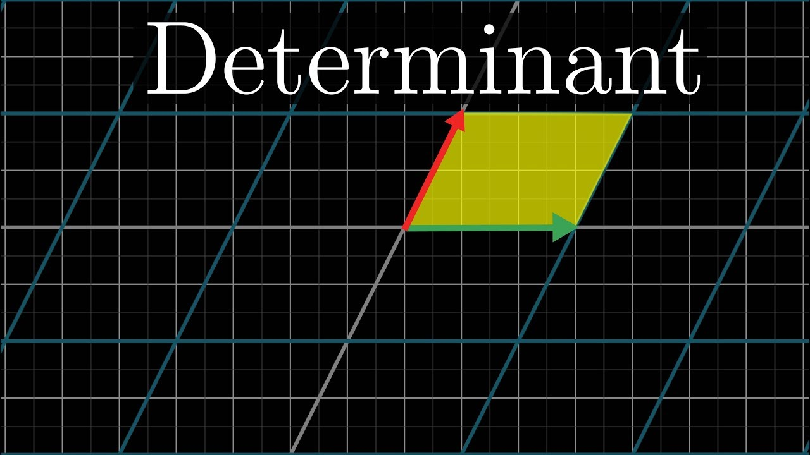
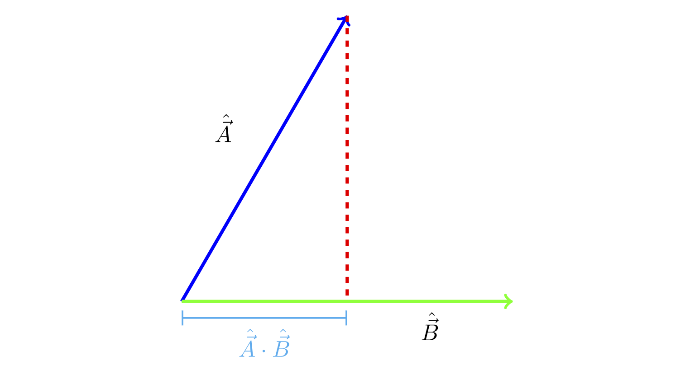
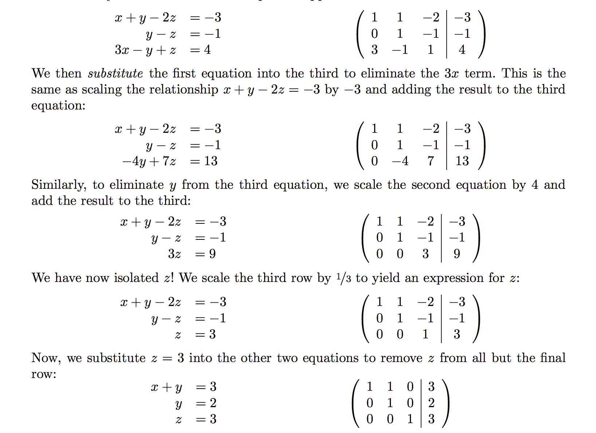

Perhaps **matrix decomposition** techniques are among the most important concepts in Machine Learning. This article will introduce some of the essences in linear algebra along with techniques that are widely popular in matrix decomposition. The content of this article is inspired by UCSD CSE 190: **Discrete and Continuous Optimization**

# The Brief Essence of Linear Algebra 

Lets consider this $\vec{x}$:
$$
\begin{bmatrix}
a \\
b 
\end{bmatrix}
$$
It lives inside a 2D space with two basis vectors $\begin{bmatrix}1 \\ 0 \end{bmatrix}$ and $\begin{bmatrix}0 \\ 1 \end{bmatrix}$. Thus, the vector can be rewriten as:

$$\vec{x} = 
\begin{bmatrix}
1 & 0 \\
0 & 1
\end{bmatrix}
\begin{bmatrix}
a \\
b
\end{bmatrix}
= 
\begin{bmatrix}
a \\
b
\end{bmatrix}
$$
By observing the equation above, we can see that the underlying basis matrix is essential in determining the space in which $\vec{x}$ lives. By changing the basis, we can translate $\vec{x}$ into completely different representations in another space with a distinct set of basis vectors, and this change of basis in linear algebra is called **linear transformation**

## Linear Transformation
The official definition of linear transformation from Wolfram Alpha is: a transformation between two vector spaces $V$ and $W$ is a map $T$:$V\rightarrow W$ such that the following hold:

- $T(v_1+v_2)=T(v_1)+T(v_2)$ for any vectors v_1 and v_2 in V, and
- $T(\alpha v)=\alpha T(v)$ for any scalar $\alpha$

Intuitively, a linear transformation rotate and scale each vectors inside one space and translate their representations onto another space such that all the parallel and orthogonal properties among vectors are being preserved. Mathematically, this can be represented as **a change of basis** for $\vec{x_1}$ and $\vec{x_2}$:

$$
M
\begin{bmatrix}
\vec{x_1} & \vec{x_2}
\end{bmatrix}
= \begin{bmatrix}
\begin{bmatrix}
q_1 & p_1 \\
q_2 & p_2 
\end{bmatrix}
\vec{x_1} & \begin{bmatrix}
q_1 & p_1 \\
q_2 & p_2 
\end{bmatrix}
\vec{x_2}
\end{bmatrix}
= \begin{bmatrix}
\begin{bmatrix}
q_1 & p_1 \\
q_2 & p_2 
\end{bmatrix}
\begin{bmatrix}
a_1\\
b_1
\end{bmatrix} & \begin{bmatrix}
q_1 & p_1 \\
q_2 & p_2 
\end{bmatrix}
\begin{bmatrix}
a_2\\
b_2
\end{bmatrix}
\end{bmatrix}
$$

The tricky concepts of here is that although $\vec{x_1}$ and $\vec{x_2}$ are being transformed by a matrix $M$ with two basis vectors $\begin{bmatrix}q_1 \\p_1\end{bmatrix}$ $\begin{bmatrix}q_2 \\p_2\end{bmatrix}$, the result of the two vectors actually lives inside the dimension space with basis vectors $\begin{bmatrix}1 \\ 0 \end{bmatrix}$ and $\begin{bmatrix}0 \\ 1 \end{bmatrix}$. This means the function of matrix $M$ is essentially translating a foreign vector into the $xy$ dimension that we are familiar with without changing any of the properties of the translated vectors.

A **different matrix-vector multiplication** can be represented as:

$$M\begin{bmatrix}a_1 & b_1\end{bmatrix} = \begin{bmatrix}\vec{c_1} \\ \vec{c_2}\end{bmatrix}\begin{bmatrix}a_1 \\ b_1\end{bmatrix} = \begin{bmatrix}\vec{c_1}\end{bmatrix}a_1 + \begin{bmatrix}\vec{c_2}\end{bmatrix}$$

Here we can see that $a_1$ and $b_1$ serves as **coefficients** for the columns of matrix $A$.

## Inverse Matrix, Rank, Null Space

We have learnt that matrix is a linear transformation of interpreting vectors from one set of basis to another set. $A$ can be considered as a matrix with column vectors as *basis vectors* that translates the vector $\vec{x}$ to our familiar world coordinate system *(xy-axis)* with [1 0] and [0 1] as basis vectors. Then how do we translate a vector $\vec{x}$ in our world coordinate systems into a system with basis of $A$?

This is where we use the **inverse matrix** of $A$, generally annotated as $A^{-1}$. What $A^{-1}$ does here is to change the basis of $x$ from [1 0] and [0 1] into the basis consists of the columns of $A$.

With the inclusion of the inverse matrix, we can now see the full picture of matrix transformation as the change of basis across systems. Here, we will introduce another essential idea called **rank** which describes the relationship among these **basis**.

The definition of rank is the number of **independent basis vector** that lives inside a matrix. 

## Determinant

The determinant of a matrix $A$ can be denotated as $\text{det}(A)$. When we perform a linear transformation, we know that all the vectors from one space are rotated, stretched and translated evenly into another space with a different set of basis (**change of basis**). Therefore, the two important aspects of a linear transformation or matrix $A$ are the rotation and the scaling factor. Determinant indicates the scaling factor of the matrix $A$.

{width=80%}

If the determinant of $A$ is $c$, then the post-transformation area between $\vec{x_1}$ and $\vec{x_2}$ will be scaled by $c$. This means that if $\text{det}(A) = 1$, the matrix $A$ does not change the magnitude of the vectors in their original space, and sometimes we call it a **rotation matrix**. If $\text{det}(A) = 0$, we know that after rotation and scaling factor, the area between $\vec{x_1}$ and $\vec{x_2}$ becomes 0, which indicates that the rotation aligned the two vectors onto the same axis. This property becomes particularly important when we are trying to use determinant in finding the **eigenvalues and eigen-decomposition** of a matrix. 

## Dot Product

The dot product represents the concept of projection in linear algebra. It is denotated as $\vec{x} \dot \vec{y}$ with x and y living in the space with same set of basis (**this is important**).

{width=80%}

$$\mathbf{u}\cdot \mathbf{v} = ||u|| \times ||v||\cos{\theta} \\
\cos \theta = \frac{\mathbf{u}\cdot\mathbf{v}}{||u||\times ||v||}$$

As we have seen in the equations, the dot product is associative, which means the projection is symmetric. Thus, $u \dot v$ can either be considered as $\vec{u}$ projected onto $\vec{v}$ or the other way around.

The implication of dot product are used in many applications such as linear regression (**least square**) and image projections. For example, the error of least square is calculated as:

$$\text{residual} = ||\vec{a} - \text{proj}_b(a) = \vec{a} - \frac{\vec{a}\dot\vec{b}}{\vec{b}\vec{b^T}}\vec{b}||_2^2$$

where $\frac{\vec{a}\dot\vec{b}}{\vec{b}\vec{b^T}}\vec{b}$ is the shadow project of $\vec{a}$ onto $\vec{b}$ 

## Eigenvalue and Eigenvector

By the fundamental theorems of algebra, a polynomial of degree **n** has **n** number of roots.

$$p = a_0 + a_1x + a_2x^2 + \ldots + a_nx^n = a(x-x_0)(x-x_1)\ldots(x-x_n)$$

This property of polynomial is not completely unique for polynomial. As we see the definition of **'root'** is somewhat different in matrix than in polynomial. We learn that matrix is about rotation, and a complicated rotation can be decompose as several rotation matrices multiple together $A = R_n\ldots R_1$, such that each $R$ rotates the space only around one axis.

This axis that $R$ rotates around is called the **eigenvector**, and the eigenvector is immuned by the transformation of $R$ as we have discussed. Therefore the definition of eigenvector is:

$$\text{there exist a non-zero vector x such that } Ax = \lambda x$$

where $x$ is called the **eigenvector** of matrix $A$, and $\lambda$ is the corresponding **eigenvalue** of such **eigenvector**. Note that **for each eigenvector, its associative eigenvalue is unique**.

Because the fundamental theorems of algebra states that there are $n$ roots exists in a $n$ degree of polynomial, we want to use it to prove that for a $n\times n$ square matrix $A$, we can also find $n$ number of **eigenvalue** that defines all the axis of rotation of matrix $A$.

**Proof**

# Matrix Decomposition

## Gaussian Elimination

There are two separate processes in **Gaussian Elimination**: the forward substitution and the backward substitution. The forward substitution requires us to perform substitution from **left to right** and **top to bottom**. This is an essential property that makes **Gaussian Elimination** works, and intuitively gaussian elimination preserves the property of the matrix as we will show in later paragraphs. 

As we have shown in the figure image, for each row operation, **forward substitution** ensures that the element before the matrix diagonal becomes 0, and **backward substitution** ensure the elements after the matrix diagonal becomes 0.

We can also consider Gaussian Elimination as a set of matrix multiplication. Consider $\vec{e_i}$ as a vector with only the $i^{th}$ element equal to 1 and the rest equals to 0. 

$$e_i = \begin{bmatrix}0 \\ \vdots \\ 1 \\ \vdots \\ 0 \end{bmatrix}$$

With this definition, the inner product of $e_i$ and $e_j$ has a value of 1, and the outter product of $e_i$ and $e_j$ becomes a matrix with all elements 0 except element $a_ij$ equals to 1.

$$e_1 e_1^T = \begin{bmatrix}1 & \ldots & 0 & 0 \\ 0 & \ldots & 0 & 0 \\ 0 & \ldots & 0 & 0 \end{bmatrix}$$

Because a forward substitution elimination matrix is a **lower triangular** matrix, we can note such matrix as $L$ matrix. And turns out we can construct such a $L$ matrix as the sum of multiple outter product of $e_i$ and $e_j$

$$L = 
\begin{bmatrix}
1 & 0 & 0 & 0 \\ 
3 & 1 & 0 & 0 \\
2 & 2 & 1 & 0 \\
5 & -1 & -2 & 2
\end{bmatrix}
= 3 
\begin{bmatrix}
0 & 0 & 0 & 0 \\ 
1 & 0 & 0 & 0 \\
0 & 0 & 0 & 0 \\
0 & 0 & 0 & 0
\end{bmatrix} + 
\begin{bmatrix}
1 & 0 & 0 & 0 \\ 
0 & 1 & 0 & 0 \\
2 & 2 & 1 & 0 \\
5 & -1 & -2 & 1
\end{bmatrix}$$

With this elimination matrix decomposition we can decompose $L$ matrix as:

$$L = E_1 + E_2 + \ldots + E_n$$ 

where $E = e_ie_j^T$

## LU Factorization

In this section, we will go through some math operations on LU Factorization and discuss why the theorem holds true under certain circumstances.

Here is the example. Let's factorize matrix $A$ into a combination of matrix $L$ and matrix $U$, such that $L$ is a lower triangular matrix of diagonal elements equal to 1 and $U$ is an upper triangular matrix with elements before the diagonal equal to 0. 

**LU Factorization**

In order to perform LU factorization, all of the upper square matrices of A must be **positive definite**.

### Theorem 1

### Theorem 2

## Cholesky Decomposition

## QR Decomposition

