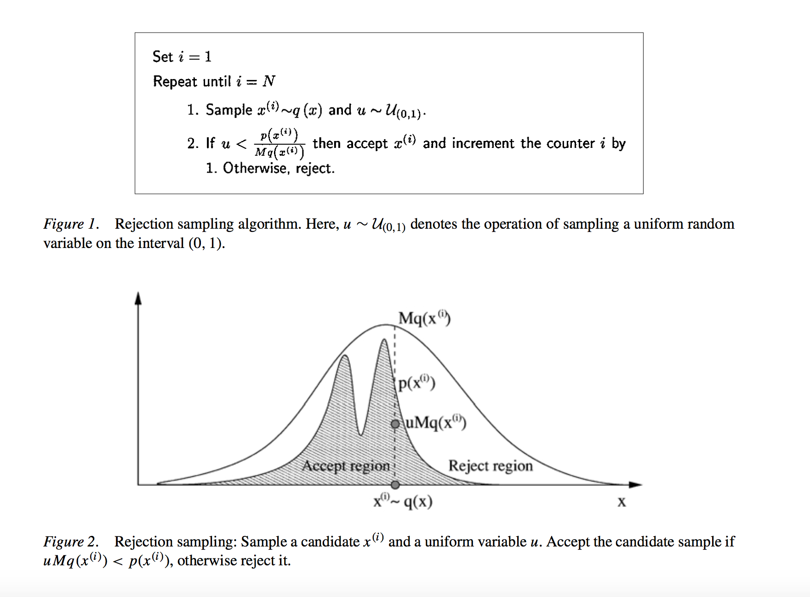
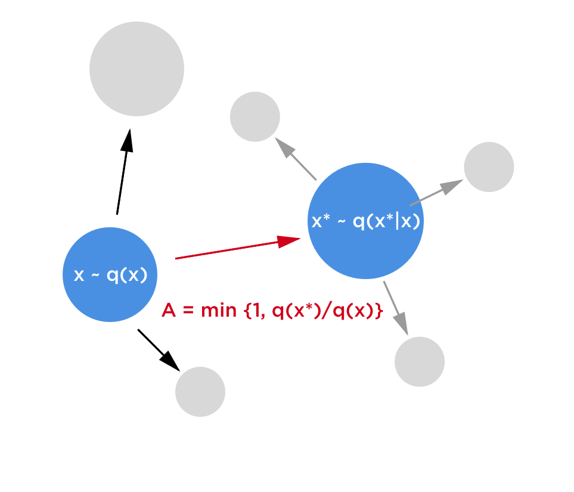
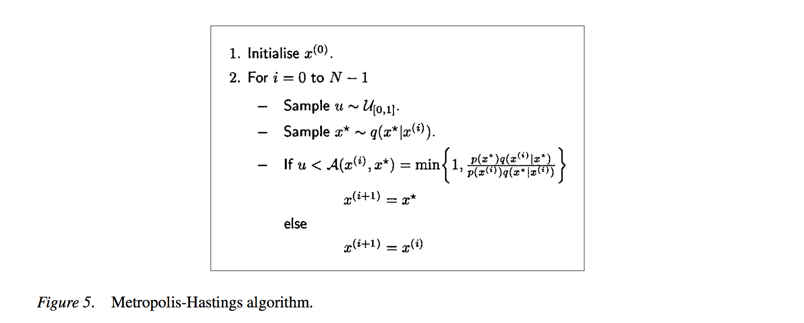
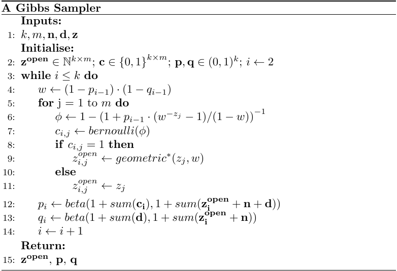

This article demonstrates my personal understanding of the **MCMC** algorithms and its variations (Metropolis–Hastings, Gibbs sampling)

Some reference articles that inspire this brief summary are:

- [UCSD CSE 250-A: Probabilistic Reasoning and Decision-Making](https://cseweb.ucsd.edu/classes/fa18/cse250A-a/#syllabus)
- Personal Note from Wheaton College MATH 364: Math Modeling
- [MIT Note: Gibbs Sampling](http://www.mit.edu/~ilkery/papers/GibbsSampling.pdf)
- [An Introduction to MCMC for Machine Learning](https://www.cs.ubc.ca/~arnaud/andrieu_defreitas_doucet_jordan_intromontecarlomachinelearning.pdf)

# Bayesian Rule

Suppose we need to estimate some parameter $\theta$ given the observation data $X$. In order to calculate the probability distribution of $\theta$ given $X$, we will need implement Bayes rule:

$$P(\theta|X) = \frac{P(X|\theta)P(\theta)}{P(X)}$$

However, the problem of Bayes rule exists in the denominator. If we apply marginalization to $P(X)$, we get:

$$P(X) = \int_\theta P(x, \theta)d\theta$$

This means that to obtain the probability of the evidence node $X$, we need to integrating the quantity over **all possible parameter values**, and sometimes parameters can have a continuous range of values. **This makes the posterior impossible to compute with a closed-form solution**. 

If we cannot solve the posterior **analytically**, how about we estimate $P(\theta|X)$ **quantitatively**?

# Monte Carlo Simulation

The idea of Monte Carlo simulation presents a promising cure to the difficulty we experience from Bayes rules. The **theorem** states that if we draw an i.i.d (independently identically distributed) sample sets ${x^{(i)}}^N_{i=1}$ from a target density $p(x)$ defined on a high-dimensional space $X$, we are able to approximate the integrals $I(f)$ with tractable sum $I_N(f)$ that converges as follows

$$I_N(f) = \frac{1}{N}\sum_{i=1}^Nf(x^(i)) \rightarrow I(f) = \int_X f(x)p(x)dx$$

where $n \to \infty$

Consider to calculate the area of a circle by sampling randomly across the space, and only count the number of those that fall within the circle. Eventually, you will retrieve sufficient samples to approximate the area of that circle, but this sampling method is very inefficient and for $p(\theta|X)$ that is not gaussian distributed, $N$ can be very large til convergence. So the question remain: is there a sampling method that guarantees more effective convergence over $P(\theta|X)$?

---

# Markov Chain (Recap)

## Definitions:

* A **Markov Chain (MC)** is a stochastic model for a system that

    * may be in one of a finite number $N$ of **states** ${1, 2, \cdots, N}$
    * may **transition** from one state to another
    * is observed at discrete **steps** (or **stages**)

* The **transition probability** $p_{ij}$ is the probability that the system will transition from state $i$ to state $j$ at the next step. A Markov chain assumes that these transition probabilities are **constant** and **memoryless** (i.e. they do not depend on time or on the history of the system's past states). Because the system can only be in a finite number of states, the sum of transition probabilities from a state *i* to all other states (including *i*) must equal **1** ($\sum_{j=1}^N p_{ij} = 1$ for all *i*)

* The **state variable** $x_{k,n}$ represents the probability that the system is in state $k$ at step $n$. The **state vector** $\vec{x_n}$ is the row vector ($x_{1,n}, x_{2,n}, x_{3,n}, \cdots, x_{N,n}$) that represents the probabilities that the system will be in the different states at step $n$. Because the system can only be in a finite number of states, the sum of the state variables at a given step must equal **1** ($\sum_{k=1}^N x_{k} = 1$)

## Markov Chain as a Linear System

The evolution of a Markov chain can be represented as a linear discrete dynamical system:

$$[x_{1,n+1}, x_{2,n+1}, x_{1,n+1}, \cdots, x_{N,n+1}] = [x_{1,n}, x_{2,n}, x_{1,n}, \cdots, x_{N,n}]
\begin{bmatrix}
p_{11} & p_{12} &\cdots &p_{1N} \\
p_{21} & p_{22} &\cdots &p_{2N} \\
\vdots & \vdots &\ddots &\vdots \\
p_{N1} & p_{N2} &\cdots &p_{NN}
\end{bmatrix}$$

In a compact form, $x_{n+1} = x_nP$, where $P$ is the transition matrix. With its closed-form solution:

$$x_k = x_0P^k$$

## Special Markov Chains

* A Markov chain is **ergodic** if the system can transition from any state to any other in a finite number of steps.
* A Markov chain is **regular** if all there exists some integer $k$ such that all the elements of $P^n$ are nonzero for $n \geq k$. (This implies that the system can transition from any state to any other in $k$ steps, so a regular MC is always ergodic)
* An **absorbing state** $i$ is a state such that $p_{ii} = 1$. A Markov chain is an absorbing Markov chain if it has one or more absorbing state, and the system is absorbed into one of them in the long run.

## Fundamental Limit Theorem

### Theorems
Let $P$ be the transition matrix of a regular Markov chain. Then $\lim_{n \to \infty} P^n = W$, where all rows of $W$ are the same vector $\vec{w}$, called the **steady state row vector**. This vector has the following properties:

* $\vec{w} = \lim_{n \rightarrow \infty}\vec{x_n}$ This is the long term state vector regardless of its initial state $\vec{x_0}$. So in the long run, the system "forgets" its initial state and settles onto the state vector $\vec{w}$
* $\vec{w}P = \vec{w}$ If the system's state vector is $\vec{w}$, it does not change at the next step.

The vector $\vec{w}$ can be found computationally (by calculating $P^n$ for large $n$) or analytically (by solving $\vec{w}(P-I)=\vec{0}$ for $\vec{w}$)

### Absorbing Markov Chains
If the absorbing states of an absorbing Markov chain are listed last, the its transition matrix can be divided into four block submatrices:
$$
P = 
\begin{bmatrix}
Q & R \\
0 & I
\end{bmatrix}
$$
where 

* Q is the transition submatrix between nonabsorbing states
* R is the transition submatrix from nonabsorbing states to absorbing states
* 0 is a matrix of zeroes
* I is an identity matrix

These matrices have the following properties:

* $\lim_{n \to \infty}Q^n = 0$. (Because the elements of each row of Q do not all add up to 1, $Q^n$ eventually decays to zero as $n \to \infty$)
* The multistep transition matrix is $P^n = \begin{bmatrix} Q^n & (\sum_{k=1}^{n-1}Q^k)R \\ 0 & I \end{bmatrix}$ In the long term, the geometric sum equals $(I-Q)^{-1}$, so the matrix becomes:

$$\lim_{n\to\infty}P^n = 
\begin{bmatrix}
0 & (I-Q)^{-1}R \\
0 & I
\end{bmatrix}
$$
    * The matrix $(I-Q)^{-1}$ is called the **fundamental matrix of the markov chain**. The sum of elements in row $i$ of this matrix is the expected time to absorption when starting at nonabsorbing state $i$.
    * The matrix $B = (I-Q)^{-1}R$ is the long term transition submatrix from nonabsorbing states to absorbing states. Each element $b_{ij}$ represents the probability of long-term absorption into state $j$, when starting in nonabsorbing state $i$

---

# MCMC

The general idea of Markov Chain Monte Carlo sampling method is to generate samples from the posterior distribution $p(\theta|X)$ by constructing a reversible Markov-chain (sequence of update to $p(\theta|X)$) that has the target posterior distribution as its equilibrium distribution. 

## Transition Matrix

In order to construct a reversible Markov-chain, it is essential guarantee the convergence of the system by designing an **ergodic** MC model with a transition matrix $T$ following these properties: 

- **Irreducibility**: For any state of the Markov chain, there is a positive probability of visiting all other states. 
- **Aperiodicity**: The chain should not get trapped in cycles.

A sufficient, but not necessary, condition to ensure that a particular $p(x)$ is the desired invariant distribution is the following reversibility (detailed balance)

$$p(x^{(i)})T(x^{i-1}|x^{i}) = p(x^{(i-1)})T(x^{i}|x^{i-1})$$

$$p(x^{(i)}) = \sum_{x^{(i-1)}}p(x^{(i-1)})T(x^{i}|x^{i-1})$$

in our case:

$$p(\theta^{(i)}|X) = \sum_{\theta^{(i-1)}}p(\theta^{(i-1)}|X)T(\theta^{i}|\theta^{i-1}, X)$$

MCMC samplers are **irreducible and aperiodic** Markov chains that have the target distribution as the invariant distribution. One way to design these samplers is to ensure that detailed balance is satisfied. However, it is also important to design samplers that **converge quickly**. 

Ultimately, by using this sampling method to **update** the posterior $P(\theta|X)$, we can computationally solve the posterior $P(\theta|X)$ without actually compute its denominator $P(X)$

$$
\frac{P(\theta^{(i)}|X)}{P(\theta^\star|X)} = \frac{P(X|\theta^{(i)})P(\theta^{(i)})}{P(X|\theta^\star)P(\theta^\star)}
$$ 

This is the core idea behind the techniques related to the modern bayesian inference.

## Proposal Distribution

Suppose we have a posterior distribution of $P(\theta|X)$ from some previous observed experience and we are unsure if such $P(\theta|X)$ is good enough, a way to optimize $P(\theta|X)$ is to sample over the existing prior distrbution of $\theta$. This distribution of $\theta$ (current prior $P(\theta)$) is called **the proposal distribution**. Therefore, we have our sampling equation:

$$\theta^\star \approx q(\theta^\star| \theta) = p(\theta)$$

## Acceptance Probability

Reviewing the equation:

$$p(\theta^{(i)}|X) = \sum_{\theta^{(i-1)}}p(\theta^{(i-1)}|X)T(\theta^{i}|\theta^{i-1}, X)$$

We know that through **proposal distribution** and sampling methods, we can compute $\sum_{\theta^{(i-1)}}p(\theta^{(i-1)}|X)$ by summing up all the sample of $\theta$ and its associate probability given $X$. Now we want to explore the transition matrix **T**. In MCMC algorithms, this matrix is in general called **acceptance probability**. The acceptance probability will take a look at the sampling quality and decide whether to update the posterior based on the sampling observations.

Design of the **acceptance probability** follows the two properties: irreducible and aperiodic, which help guarantee algorithmic convergence over $P(\theta|X)$. Different sampling methods will have different **acceptance probability**. For example, **rejection sampling** has the acceptance probability as $u < \frac{p(x^{i})}{Mq(x^{i})}$ where $M$. However, this sampling is inefficient since it simply discard samples that fall under the rejection area without fully utilizing the information. 

An easy way to illustrate the similarity between MCMC and Markov Chain Model is to consider **proposal distribution** as the sampling distribution of $\theta^\star$ base on the current state prior $P(\theta_n)$, and the **acceptance probability** as transition matrix that guarantee convergence of $P(\theta|X)$ over the long run.

{width=80%}

## Metropolis-Hastings

**Metropolis-Hastings** is one of the most popular MCMC algorithm. Its **acceptance probability** $A$ is:

$$A(\theta^{(i)}, \theta^\star) = \text{min}\{1, \frac{p(\theta^\star|X)}{p(\theta^{(i)}|X)}\}$$

If $p(\theta^\star|X) > p(\theta^{(i)}|X)$, by definition of the acceptance probability, we will update the new proposal distribution as $q(\theta^\star) = q(\theta^\star)$. Otherwise, we will accept the new sample proposal with an $A$ probability. This means if $p(\theta^\star|X) > p(\theta^{(i)}|X)$, the closer the two results are, the likely $q(\theta^\star)$ will be updated with the new sample results.

## Gibbs Sampling

---
